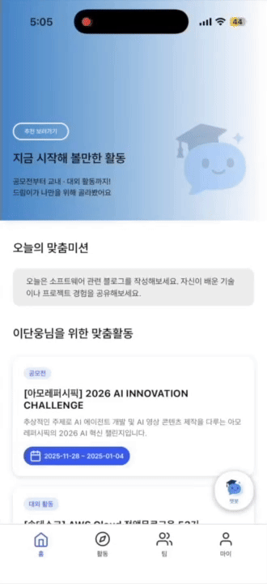
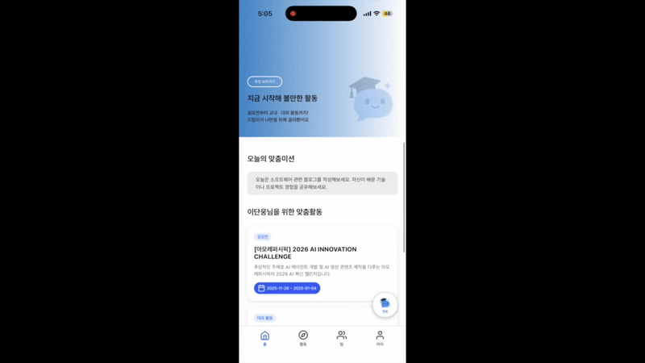
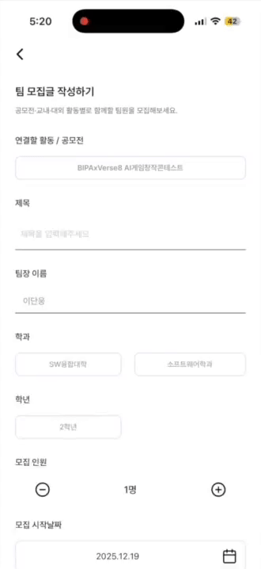

# DANSPEC (단스펙) - FE

## 프로젝트 소개
🏷️ **프로젝트명: DANSPEC(단스펙)**<br>
🏆 **TABA 10기 프로젝트 발표회 장려상 수상**

---

## 🎯 서비스 소개
>DANSPEC은 사용자 데이터 분석 기반 맞춤형 활동 추천 및<br>
>팀 빌딩 최적화를 통한 단국대 전용 커리어 성장 지원 서비스입니다

---

## 📅 프로젝트 기간 및 팀원
### 프로젝트 기간
2025.11 ~ 2025.12
### 프로젝트 팀원
|name|position|
|------|---|
|김태현|프론트엔드|
|신동은|프론트엔드|

---

## 🚀 주요 기능
1️⃣ **사용자 맞춤형 활동 추천** 
* **개인화 추천 알고리즘**: 프로필 데이터를 기반으로 공모전, 대외·교내 활동 매칭
* **성장 가이드**: 개인별 성장을 돕는 오늘의 맞춤 미션 제공



2️⃣ **활동 탐색 및 AI 챗봇 지원**
* **통합 검색 엔진**: 카테고리별·태그별 필터링을 통한 효율적인 정보 탐색
* **AI 챗봇 상담**: 자소서 소재 추천 및 스펙 관련 궁금증 실시간 답변



3️⃣ **팀 매칭 및 현황 관리**
* **활동 기반 팀 모집**: 역할·일정 설정 기반 팀 개설 및 지원자 승인·거절 관리
* **실시간 참여 알림**: 팀 지원 현황 및 합류 여부 실시간 알림 확인



4️⃣ **사용자 활동 분석 및 맞춤 피드백**
* **역량 분석 리포트**: 활동 기반 강점·약점 및 단계별 성장 지표(양호·보완·개선) 도출
* **맞춤형 활동 추천**: 부족한 역량 보완을 위한 활동 제안 및 이력 관리

---

## ⚙️기술 스택
<b>[Frontend]</b><br>
-   

---

## 🎨서비스 플로우 (Figma)
서비스 화면 구성 및 플로우를 [Figma에서 확인](https://www.figma.com/design/kRLK2x2HWcd80S7DdDBsaX/DANSPEC?node-id=0-1&t=SZBuM4vy310TgYzx-1)할 수 있습니다.

---

### 사전 준비
- Node.js
- npm
- Expo GO
<br>

## 설치 및 실행
1. **레포지토리 클론**
```bash
git clone https://github.com/taehyeonee823/DANSPEC.git
cd rn-starter
```
2. **설치 및 실행**
```bash
npm install
npm run start
```
3. Expo Go 앱으로 QR 코드 스캔 후 실행

---

## 📢 유의 사항
* 본 프로젝트는 대회 출품 및 기술적 검증을 위한 포트폴리오 용도로 제작되었습니다
* 데이터 출처: [캠퍼스픽](https://www.campuspick.com/), 영웅스토리
* 본 서비스는 수집된 데이터를 상업적으로 활용하지 않으며, 모든 저작권은 원천 데이터 제공처에 있습니다
* 본 서비스는 백엔드 개발자 및 기획자와의 협업으로 제작된 팀 프로젝트입니다
